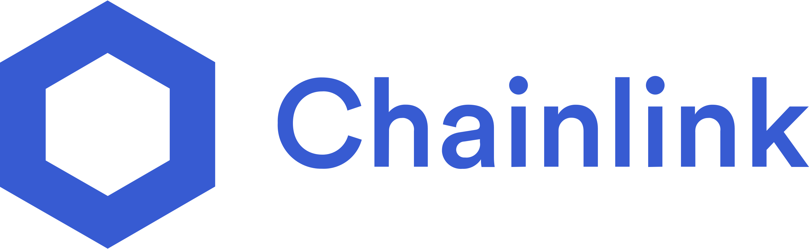

# FLink
[](https://www.filswan.com/)
[](https://discord.com/invite/KKGhy8ZqzK)
[](https://github.com/RichardLitt/standard-readme)

- Join us on our [public discord channel](https://discord.com/invite/KKGhy8ZqzK) for news, discussions, and status updates. 
- [Check out our medium](https://filswan.medium.com) for the latest posts and announcements.

Flink is a data provider DAO aiming at offer Chainlink Oracle service for Filecoin Network. The implementation
offered deal information on multi chains for users who want to store their data on Filecoin network.

Our v1 release provides the Filecoin data info available on Polygon network.

## What is Filecoin - Chainlink Data Provider

While a user from blockchains like Ethereum,BSC,Polygon want to store large amount of data offchain, filecoin is the
best option. On Filecoin network,users can store data in and retrieve data from the Filecoin network via deals.However
how to create a proof cross chain is not resolved. It is a gap between other blockchain storage needs and Fileocin
storage solution.

[External adapter](https://docs.chain.link/docs/external-adapters) allow access to high-quality data and enable extreme
flexibility to connect smart contracts to premium web APIs. With chainlink external adapter, user can check their deal
information on oracle node operator.

### Sample Use Case

#### Polygon NFTs USDC payment for Filecoin storage

If a user wants to save his NFT long term (e.g. 540 days) on Filecoin network, he needs the following steps

* Lock a payment on polygon network
* Token swap to Filecoin agent
* Filecoin agent send NFT in deals to filecoin storage providers
* Deal ID onchain
* Chainlink oracle broadcasting the proof to Polygon network
* Storage DAO notaries signed the data based on deal infor provided by the chainlink oracle
* NFT payment uncloked to the Filecoin agent


## Design Structure

Flink requires two components to work as a data provider:

* Data aggregator
* Chainlink external adapter
* Data DAO notary

Several blockchain scanner aggeragate the data to a unified data provider, the chainlink esternal adapter with the oracle smartcontracs broadcasting the proof to target blockchain networks. Data notaries will sign the transaction based the oracle data onchain informtion.The payment is triggered once the proof that it has been stored on the Filecoin network is relayed from Chainlink oracles.

### Data aggregator

When FIlecoin agent send the data to a storage provider, the data storage process starts. Only when the storage provider
accept the deal and push a deal acceptance information on chain, it means the deal is setup and a deal id will be on
filecoin network. The data aggregator will scan the filecoin deal information from different data source and send the
information as an API interface. check the [data](data) directory for the scan related code. A typical deal info is in
this format:

curl -X POST -H "content-type:application/json" "https://flink-data.filswan.com/deal" --data '{ "deal_id":"87000", "network_name":"filecoin_mainnet"}'

```json
{
    "status": 200,
    "data": {
        "deal": {
            "deal_id": 87000,
            "deal_cid": "",
            "message_cid": "bafy2bzacec4u45aw7nppxdlntq5dm5t5mywjeb2ip6ccmobrrogjumn7uek36",
            "height": 38383,
            "piece_cid": "baga6ea4seaqoal6r72tydlzahwlanik2b6x5ffwh74ollis4zga4kzhy7okywmy",
            "verified_deal": false,
            "storage_price_per_epoch": 62500000,
            "signature": "",
            "signature_type": "",
            "created_at": 1599457890,
            "piece_size": "134217728",
            "start_height": 44123,
            "end_height": 746032,
            "client": "f1nslxql4pck5pq7hddlzym3orxlx35wkepzjkm3i",
            "client_collateral_format": "000000000000000000",
            "provider": "f018520",
            "provider_tag": "",
            "verified_provider": 0,
            "provider_collateral_format": "000000000000000000",
            "status": 0,
            "network_name": "filecoin_mainnet",
            "storage_price": 43869312500000
        },
        "result": 43869312500000
    }
}
```

### Chainlink External Adapter - DATA DAO

After the data aggregator get the deal information, a External adapter is needed for offering API access for data DAO
notaries in next step.
A typical deal info is in this format:

https://flink-adapter.filswan.com/deal/5210178?network=filecoin_mainnet

For detailed information about how to build and deployed External Adapter, please check the code in [adapter](adapter)

### Data DAO Notary

Data DAO notary is in charged of sign the multisig wallet for unlock the fund to filecoin strorage agent.

The DAO contract allowed the community add or remove notaries from the DAO. The DAO Notary client follow these steps
before sign the unclock transactions:

* get deal_id by proposal_cid
* get deal_id from Chainlink filecoin adapter
    * if matches trigger DAO signature
        * match client_address
        * match deal_cid (proposal_cid)
    * else waiting for next check cycle

## Roadmap

* March 14th,2022:  The mainnet lanunch with Polygon network
* June 6th, 2022:   Notary DAO setup

## Sponsors

This project is sponsored by Filecoin Foundation & Chainlink:

[RFP : chainlink and filecoin data bounties](https://github.com/filecoin-project/devgrants/pull/290)
[Blog : FilSwan Awarded Chainlink-Filecoin Joint Grant to Create Multi-Chain Decentralized Data Storage Payment Solution](https://blog.chain.link/filswan-chainlink-filecoin-joint-grant)

  

